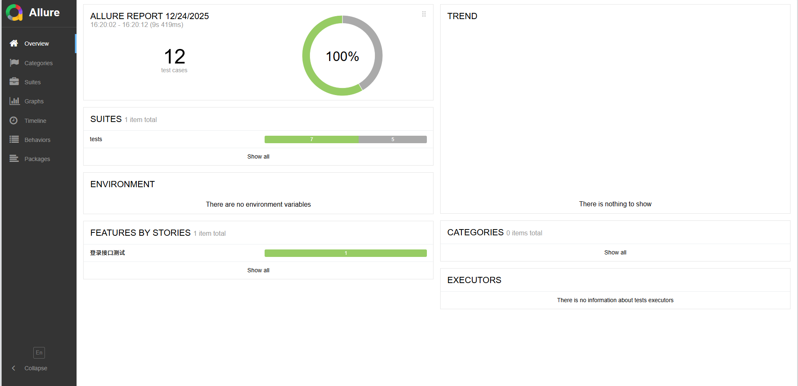
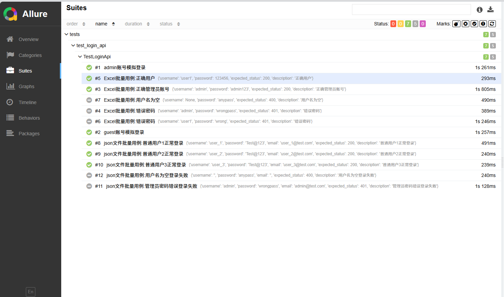
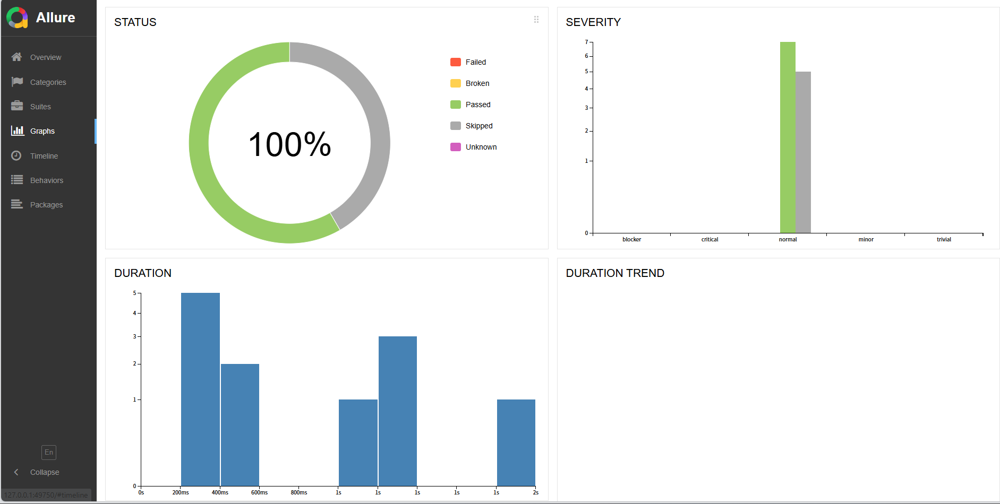
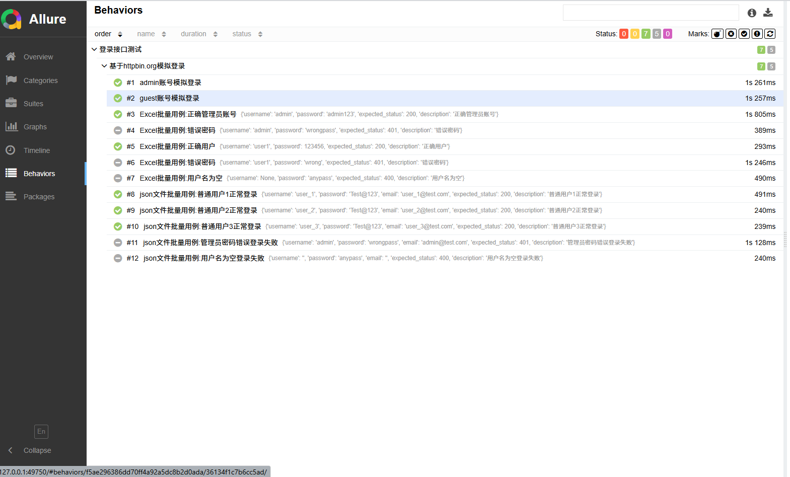

# 自动化测试项目
基于Python+Pytest+Allure实现了登录接口自动化测试，支持 Excel/JSON 双数据驱动，已完成全量测试用例执行
Web自动化测试还未完成，后续会继续完善

# 项目结构
automation-test-project/
├── assets/                  # 静态资源/截图目录
│   └── allure/              # Allure报告截图子目录
│       ├── allure_overview.png
│       ├── allure_suites.png
│       ├── allure_graphs.png
│       └── allure_behaviors.png
├── config/                  # 配置目录
│   └── config.json          # 接口基础配置
├── core/                    # 核心工具包
│   ├── __init__.py
│   ├── api_client.py        # HTTP请求封装（含日志、会话保持）
│   ├── config_manager.py    # 配置读取与管理
│   └── data_reader.py       # 测试数据解析工具
├── data/                    # 测试数据目录
│   ├── test_data.json       # JSON格式测试数据
│   └── test_data.xlsx       # Excel格式测试数据
├── logs/                    # 日志目录
│   └── apilog               # 接口请求日志
├── pages/                   
│   └── login_page.py        # 未作修改
├── reports/                 # 测试报告（自动生成）
│   └── allure-results       # Allure原始报告数据
├── tests/                   # 测试用例目录
│   ├── __init__.py
│   ├── conftest.py          # Pytest夹具配置
│   ├── test_login_api.py    # 登录接口测试用例
│   ├── test_web.py          # 未作修改
│   └── test_login.html      # 未作修改
├── .gitignore               # Git忽略规则
├── pytest.ini               # Pytest配置文件
├── requirements.txt         # 项目依赖清单
├── run_tests.py             # 测试执行入口
└── README.md                # 项目说明

# 项目更新内容
## 1. 文件命名规范

| 模块/用途       | 原文件名| 现文件名          |
|-----------------|------------------------|---------------------------|
| 接口请求封装    | ApiClient.py    | api_client.py             |
| 配置管理        | ConfigManager.py | config_manager.py |
| 测试数据解析    | TestDataReader.py | data_reader.py |
| 测试用例        | test_api.py          | test_login_api.py         |
| 执行脚本        | run.py                 | run_tests.py              |

## 2. 工具包功能重构
对核心工具模块进行了全面的功能增强，提升测试效率和可维护性
* api_client.py：新增请求/响应日志（输出至logs/apilog）、会话保持、超时重试机制，封装了 POST/GET通用请求方法，减少重复代码
* config_manager.py：支持配置项默认值返回、数据类型校验，避免因配置键缺失导致程序崩溃，同时优化了配置读取效率
* data_reader.py：实现Excel/JSON格式测试数据的解析，支持按场景过滤数据并生成Pytest参数化数据集，实现批量用例执行

## 3. 测试框架集成
- 引入 Pytest 框架：实现测试用例的规范化管理，支持参数化、夹具、自定义标记等特性，大幅提升用例复用性和执行灵活性
- 集成 Allure 报告：生成可视化的测试报告，可直观查看用例执行结果、失败原因及接口请求日志，便于问题定位和复盘

## 4. 配置与数据优化
- 测试数据优化：统一测试数据文件命名，从仅支持登录数据扩展为支持多模块、多场景的测试数据驱动
- 标准化配置文件：
    1. `__init__.py`：标识python包;控制包的导入
    2. pytest.ini：配置 Pytest 用例扫描规则、自定义login标记，消除运行警告
    3. requirements.txt：锁定 pytest、allure-pytest、requests 等依赖版本

# 测试结果
- 总测试用例数：12个
- 正常登录场景：7个用例全部通过，符合预期
- 异常登录场景：5个用例因接口返回预期错误码，标记为预期失败
- 报告查看方式：运行脚本后自动打开，或手动执行`allure serve reports/allure-results`命令启动报告

## Allure报告展示
### 报告概览（总览统计）

### 用例执行列表（详细用例状态）

### 测试统计图表（状态/耗时分布）

### 用例行为分类（场景/模块划分）
